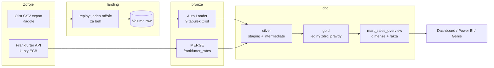
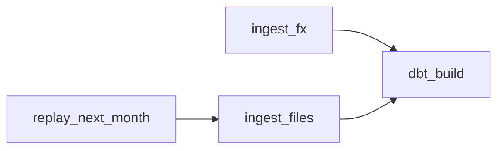
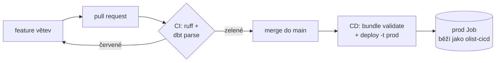

# Olist Lakehouse na Databricks

[English](README.md) | **Čeština**

End-to-end datová platforma postavená na **Databricks Free Edition**. Simulované denní dodávky souborů a REST API se načítají do lakehouse s medallion architekturou, transformují se v **dbt**, orchestruje je **Databricks Job** definovaný jako kód (**Asset Bundle**) a do produkce se dostávají přes **CI/CD** v GitHub Actions se service principalem.

Cílem projektu není jen vyrobit tabulky, ale ukázat, jak se produkční datová pipeline navrhuje, testuje, nasazuje a provozuje, a proč bylo každé rozhodnutí uděláno právě takhle.

---

## Obsah

1. [Architektura](#architektura)
2. [Technologie](#technologie)
3. [Zdroje dat](#zdroje-dat)
4. [Struktura repozitáře](#struktura-repozitáře)
5. [Pipeline](#pipeline)
6. [Rozhodnutí v datovém modelu](#rozhodnutí-v-datovém-modelu)
7. [Marty](#marty)
8. [Kvalita dat](#kvalita-dat)
9. [Prostředí a nasazení](#prostředí-a-nasazení)
10. [CI/CD a governance](#cicd-a-governance)
11. [Známé problémy v datech](#známé-problémy-v-datech)
12. [Limity Free Edition a co bych dělal ve větším měřítku](#limity-free-edition-a-co-bych-dělal-ve-větším-měřítku)
13. [Jak projekt spustit](#jak-projekt-spustit)
14. [Další kroky](#další-kroky)

---

## Architektura



| Vrstva | Kde | Nástroj | Obsah |
|---|---|---|---|
| landing | `<katalog>.landing` (volumes) | Python | Zdrojové soubory přesně tak, jak přišly |
| bronze | `<katalog>.bronze` | Auto Loader, REST | Surová data 1:1, všechny sloupce jako text, auditní sloupce |
| silver | `<katalog>.silver` | dbt | Otypovaná, vyčištěná, deduplikovaná data s anglickými názvy |
| gold | `<katalog>.gold` | dbt | Sdílené dimenze a fakta, **veškerá byznys logika je tady** |
| mart | `<katalog>.mart_<oblast>_<report>` | dbt | Views pro jeden report: výběr, filtr, agregace, žádná nová logika |

**Katalog = prostředí** (`olist_dev`, `olist_prod`), **schéma = vrstva**. Obě prostředí staví stejný kód, liší se jen katalog.

---

## Technologie

| Oblast | Technologie |
|---|---|
| Platforma | Databricks Free Edition (serverless výpočty, Unity Catalog) |
| Ingest | PySpark, Auto Loader, Python `requests` |
| Transformace | dbt-core 1.12, dbt-databricks 1.12, dbt_utils |
| Orchestrace | Databricks Jobs |
| Infrastruktura jako kód | Databricks Asset Bundles |
| CI/CD | GitHub Actions, ochrana větve (ruleset), service principal (OAuth M2M) |
| Kvalita kódu | ruff, dbt parse s varováními jako chybami, dbt testy |
| Lokální vývoj | VS Code, Python 3.12 venv, Databricks CLI |

---

## Zdroje dat

- **Olist Brazilian E-Commerce**: přibližně 99 tisíc objednávek z období 2016-09 až 2018-10, 9 souvisejících tabulek (objednávky, položky, platby, recenze, zákazníci, prodejci, produkty, geolokace, překlad kategorií). Zdroj Kaggle, licence **CC BY-NC-SA 4.0**.
- **Frankfurter API**: denní kurzy vydávané Evropskou centrální bankou. Slouží k převodu BRL na EUR, CZK a USD.

Olist je jednorázový historický export. Aby se simuloval živý zdrojový systém, transakční tabulky se **přehrávají po měsících** (viz [Pipeline](#pipeline)).

---

## Struktura repozitáře

```
olist-lakehouse-databricks/
├── databricks.yml              # Asset Bundle: proměnné, targety dev/prod
├── resources/
│   └── olist_daily.job.yml     # Job: tasky, závislosti, plán spouštění
├── .github/workflows/
│   ├── ci.yml                  # Kontroly u každého pull requestu
│   └── cd.yml                  # Nasazení do prod po merge do main
├── requirements.txt            # Závislosti pro běh (dbt)
├── requirements-dev.txt        # Nástroje pro vývoj a CI (ruff)
├── setup/                      # Jednorázová příprava prostředí (pro každý katalog)
│   ├── 00_unity_catalog        # Katalog, schémata vrstev, volumes
│   ├── 01_download_olist       # Stažení datasetu do landing
│   ├── 02_prepare_replay_source# Přesun plných exportů do source, reset replaye
│   └── 03_replay_months        # Simulovaný zdrojový systém (range / next)
├── src/ingestion/              # Znovupoužitelný, testovatelný Python kód
│   ├── config.yml              # Tabulky, nastavení CSV, nastavení kurzů
│   ├── autoloader.py           # Obecný ingest CSV -> Delta
│   ├── api_client.py           # REST klient: retry, backoff, timeout
│   └── frankfurter.py          # Inkrementální ingest kurzů s MERGE
├── notebooks/                  # Tenké spouštěče, které volá Job
│   ├── 01_ingest_files
│   └── 02_ingest_fx
├── dbt/
│   ├── models/staging/         # silver: 1:1 se zdroji, typy a čištění
│   ├── models/intermediate/    # silver: znovupoužitelné technické mezikroky
│   ├── models/gold/            # gold: dimenze a fakta, veškerá logika
│   ├── models/marts/           # marty: jedno schéma na report
│   ├── macros/                 # Sdílená logika (pravidlo tržeb, vzdálenost, názvy schémat)
│   └── seeds/                  # Malé referenční mapování (skupiny kategorií)
├── tests/                      # Testy Pythonu (plánované)
└── docs/                       # Diagramy a dokumentace
```

**Proč jsou notebooky tenké:** logika je v `src/` jako běžné Python moduly, které jde testovat a v CI kontrolovat linterem. Notebooky jen čtou parametry a volají funkce.

---

## Pipeline

Job `olist_daily` běží každý den v 6:00 (Europe/Prague):



| Task | Co dělá | Proč |
|---|---|---|
| `replay_next_month` | Zapíše do landing další měsíc objednávek, položek, plateb a recenzí | Simuluje zdrojový systém, který každý den posílá nové soubory |
| `ingest_files` | Auto Loader načte nové soubory do bronze | Inkrementálně a idempotentně: checkpoint si pamatuje zpracované soubory |
| `ingest_fx` | Zavolá Frankfurter API od posledního načteného data (watermark) a provede MERGE do bronze | Běží **paralelně**, na souborech Olistu nezávisí |
| `dbt_build` | `dbt deps` + `dbt build`: seedy, modely a testy od silver po marty | Čeká na **oba** ingesty, aby se gold stavěl vždy z čerstvých dat |

### Replay (simulovaný zdroj)
- `mode=range`: ruční backfill zadaného rozsahu měsíců.
- `mode=next`: používá Job. Poslední přehraný měsíc zjistí **z názvů souborů** v landing (soubory jsou jediný zdroj pravdy, žádná další stavová tabulka) a zapíše další měsíc, **který ve zdroji existuje**. Ve zdroji jsou díry, takže „poslední + 1“ by se mohlo zaseknout.
- Soubor `orders` se zapisuje **jako poslední** a slouží jako **commit marker**: napůl zapsaný měsíc se udělá znovu, nikdy se nepřeskočí.
- Když zdroj dojde, notebook skončí čistě hláškou `no new month` a Job zůstane zelený.

### Ingest do bronze
- Auto Loader s `availableNow`, všechny sloupce jako text (typy řeší silver), evoluce schématu s rescued data.
- Auditní sloupce: `_ingested_at`, `_source_file`, `_source_file_name`, `_source_file_modified_at`, `_batch_id`.
- API klient pro kurzy: timeout, retry s exponenciálním backoffem u 429/5xx, okamžitý pád u 4xx. Dlouhý formát (jeden řádek = datum × měnový pár), takže nová měna je změna konfigurace, ne schématu. `MERGE` na `(rate_date, base, quote)` dělá opakované běhy bezpečnými.

### Vrstvy v dbt
- **staging** (`stg_<zdroj>__<tabulka>`): typy, přejmenování, ořezání mezer, deduplikace, opravy překlepů ze zdroje. Klíče se nikdy nemění.
- **intermediate** (`int_`): znovupoužitelné technické kroky, např. průměrné souřadnice na PSČ nebo denní kurzy s doplněním víkendů.
- **gold**: `calendar`, `customer`, `seller`, `product`, `fx_rate_daily`, `sales_order`, `order_item`, `order_payment`, `order_review`.
- **mart** `mart_sales_overview`: `dim_calendar`, `dim_customer`, `dim_seller`, `dim_product`, `fct_sales_order`, `fct_order_item`, `fct_payment`, `fct_fx_rate`.

---

## Rozhodnutí v datovém modelu

| Rozhodnutí | Proč |
|---|---|
| **Veškerá byznys logika je v gold, marty jen vybírají, filtrují a agregují** | Každá metrika má jednu definici. Dva reporty nikdy nespočítají „tržby“ jinak. |
| **Nejdřív grain, metrika patří ke svému grainu** | Doba doručení je vlastnost objednávky, ne položky. |
| **Položky se nikdy nespojují přímo s platbami** | Obojí navazuje na objednávky. Přímé spojení násobí řádky a nafukuje tržby (fan-out). Každá tabulka se nejdřív agreguje na úroveň objednávky. |
| **Zákazník = osoba** (`customer_unique_id`) | Zdroj vytváří nové `customer_id` pro každou objednávku. Analýza opakovaných nákupů potřebuje skutečnou osobu. |
| **Doručovací adresa patří k objednávce** | Zdroj nemá CRM a člověk může posílat na různá místa (250 zákazníků to udělalo). Gold `customer` drží jen `last_delivery_*`. |
| **Kurz z data objednávky, víkendy doplněné posledním známým kurzem** | Používají se jen kurzy známé v daném okamžiku, bez look-ahead biasu. |
| **Peníze jako `decimal` s příponou měny** (`_brl`, `_eur`, `_czk`) | Přesné počítání a měna je vždy vidět v názvu sloupce. |
| **PSČ jako text doplněný zleva na 5 číslic** | Úvodní nuly jsou součást kódu, nejde o číslo. |
| **`left join` ve faktech + testy `not_null`** | Fakt nikdy potichu neztratí řádky. Chybějící vazba místo toho shodí test. |
| **Kalendář nefiltrovaný, fakta filtrovaná na analytické období** | Časová inteligence v BI potřebuje úplný kalendář. Neúplné okrajové měsíce se do reportů nedostanou, ale v gold zůstávají. |
| **Zrušené objednávky zůstávají s příznakem** (`is_revenue_eligible`) | Filtrování je rozhodnutí reportu, ne modelu. |
| **Žádná rezervovaná slova** (`date` -> `calendar`, `order` -> `sales_order`) | V SQL ani v BI nástrojích není potřeba nic escapovat. |

---

## Marty

### mart_sales_overview
Odpovídá na otázky: *Kolik prodáváme, kde, co a jak zákazníci platí? Jak vypadají čísla v EUR a CZK?*

| Tabulka | Grain (jeden řádek = ) | Hlavní obsah |
|---|---|---|
| `fct_sales_order` | jedna objednávka | hodnota objednávky a platby v BRL/EUR/CZK, doba doručení a zpoždění, příznaky (doručeno, zrušeno, pozdě, započítat do tržeb), hodnocení |
| `fct_order_item` | jeden prodaný kus | cena a doprava v BRL/EUR/CZK, produkt, prodejce, vzdálenost prodejce → zákazník |
| `fct_payment` | jedna platba objednávky | způsob platby, splátky, částka v BRL/EUR/CZK |
| `fct_fx_rate` | jeden den | kurzy BRL na EUR, CZK a USD |
| `dim_calendar` | jeden den | rok, kvartál, měsíc, týden, víkend, příznak analytického období |
| `dim_customer` | jedna osoba | poslední město a stát doručení, první a poslední objednávka, příznak opakovaného zákazníka |
| `dim_seller` | jeden prodejce | město, stát, souřadnice |
| `dim_product` | jeden produkt | zobrazovaný název, kategorie, skupina kategorií |

Fakta jsou filtrovaná na analytické období (2017-01 až 2018-08). Kalendář je úplný kvůli časové inteligenci v BI.

## Kvalita dat

- **dbt testy (133)**: `unique`, `not_null`, `relationships`, `accepted_values`, rozsahové a výrazové testy z `dbt_utils` na všech vrstvách.
- **Referenční integrita se testuje ze strany potomka** (`orders.customer_id -> customers`). Zákazníci přicházejí jako plný referenční export, objednávky po měsících, takže zákazník zatím bez objednávky je v pořádku.
- **Rekonciliační test** (warn): platby za objednávku vs. hodnota položek + doprava, tolerance 1 BRL.
- **Freshness zdrojů** u transakčních tabulek a kurzů (varování po 2 dnech, chyba po 7).
- **Varování jsou v CI chyby**: položka v YAML, která nesedí na žádný model, shodí pull request. Netestovaný model tak nikdy neprojde potichu.

---

## Prostředí a nasazení

Celý Job je definovaný v [`databricks.yml`](databricks.yml) a [`resources/olist_daily.job.yml`](resources/olist_daily.job.yml).

| | dev | prod |
|---|---|---|
| Katalog | `olist_dev` | `olist_prod` |
| Název Jobu | `[dev <uživatel>] olist_daily` | `olist_daily` |
| Plán | automaticky pozastavený | denně v 6:00 |
| Nasazuje | vývojář ze svého počítače | jen GitHub Actions |
| Běží pod | vývojářem | service principalem `olist-cicd` |

- **Stejný recept, jiné proměnné**: dev i prod se staví ze stejného kódu, takže co se otestovalo v dev, přesně to běží v prod.
- **Service principal** `olist-cicd`: technická identita jen s nezbytnými oprávněními (katalog `olist_prod` a SQL warehouse, žádný admin). Produkce funguje dál, i když člověk odejde.
- **Pevná cesta pro prod** ve složce service principalu: ať nasazuje kdokoli, existuje vždy jen jedna produkční kopie.
- V repozitáři nejsou žádná tajemství ani osobní údaje: warehouse se dohledává podle názvu, e-mail pro chyby se doplňuje z proměnné naplněné GitHub secretem.

---

## CI/CD a governance



- **CI** ([`ci.yml`](.github/workflows/ci.yml)) u každého pull requestu: nainstaluje zafixované závislosti, pustí `ruff` na `src/` a `dbt parse --warn-error`. Nepotřebuje přístup do Databricks, je tedy rychlé a zdarma.
- **Ochrana větve** (GitHub ruleset na `main`): změny jen přes pull request, merge jen se zeleným CI, zákaz smazání a force push.
- **CD** ([`cd.yml`](.github/workflows/cd.yml)) po každém merge do `main`: zvaliduje a nasadí bundle do prod, přihlášené jako service principal.
- **Secrets** (`DATABRICKS_HOST`, `DATABRICKS_CLIENT_ID`, `DATABRICKS_CLIENT_SECRET`, `ALERT_EMAIL`) jsou jen v GitHub Secrets. OAuth secret má omezenou platnost a musí se pravidelně obnovovat.

---

## Známé problémy v datech

| Problém | Řešení |
|---|---|
| Zhruba 250 objednávek, kde platby nesedí s hodnotou položek + dopravy (víc: úroky ze splátek kartou; méně: vouchery, slevy) | Ponecháno, vystaveno jako `payment_difference_brl`, rekonciliační test je nastavený na warn |
| Okrajové měsíce jsou neúplné (2016, 2018-09, 2018-10) | Analytické období 2017-01 až 2018-08 (dbt vars). Fakta v martech jsou filtrovaná, gold drží všechno |
| Překlepy v anglických názvech kategorií (`fashio_female_clothing`, `costruction_tools_*`, `home_confort` …) a dvě nepřeložené kategorie | Opraveno ve stagingu a seedem, klíče se nemění |
| Jedno `review_id` může pokrývat víc objednávek | Klíč recenzí je `review_id + order_id` |
| Geolokační body mimo Brazílii | Označené `is_within_brazil`, vyřazené z průměrů na PSČ |
| Jen asi 3 % zákazníků nakoupila víc než jednou | Byznys poznatek, ne chyba. Důležité pro analýzu retence |

---

## Limity Free Edition a co bych dělal ve větším měřítku

| Limit / zjednodušení tady | Ve větším měřítku |
|---|---|
| Denní kvóta výpočtů. Po vyčerpání se běhy pozastaví | Placený workspace s rozpočty a cluster policies |
| Jeden malý sdílený SQL warehouse. Studený start může trvat mnoho minut | Vlastní warehouse pro Job s garantovanou kapacitou |
| Replay simuluje zdroj, Job běží podle času | Reálný zdroj + **file arrival trigger**: běh, když soubory opravdu dorazí |
| Gold se přestavuje celý | Inkrementální modely (`merge` na byznys klíčích) pro velká fakta |
| Žádná historie změn atributů | SCD2 snapshoty pro dimenze jako produkty nebo prodejci |
| CI jen parsuje dbt | CI v2: `dbt build` změněných modelů do izolovaného CI schématu |
| Bronze zapisují notebooky | Lakeflow Declarative Pipelines s expectations pro ingest |

---

## Jak projekt spustit

**Předpoklady:** Databricks workspace (stačí Free Edition), Python 3.12, Databricks CLI, repozitář na GitHubu.

1. **Příprava prostředí**: spusť notebooky ve `setup/` s widgetem `catalog = olist_dev` (nebo `olist_prod`):
   `00_unity_catalog` -> `01_download_olist` -> `02_prepare_replay_source` -> `03_replay_months` (`mode=range`, např. 2016-09 až 2017-12).
2. **Lokální dbt**: vytvoř venv, `pip install -r requirements-dev.txt`, nastav `DBT_DATABRICKS_HOST`, `DBT_DATABRICKS_HTTP_PATH`, `DBT_DATABRICKS_TOKEN` (viz `.env.example`) a `~/.dbt/profiles.yml`, který je čte. Pak `cd dbt && dbt deps && dbt build`.
3. **Nasazení Jobu do dev**
   ```bash
   databricks auth login --host <url-workspace>
   databricks bundle validate
   databricks bundle deploy
   databricks bundle run olist_daily
   ```
4. **Produkci** nasazuje jen CD po merge do `main`.

---


---

*Data: Olist Brazilian E-Commerce Public Dataset (CC BY-NC-SA 4.0); kurzy: Frankfurter API / Evropská centrální banka.*
