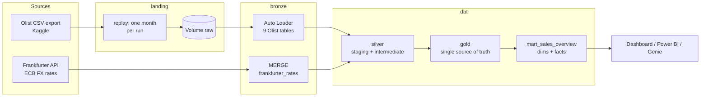
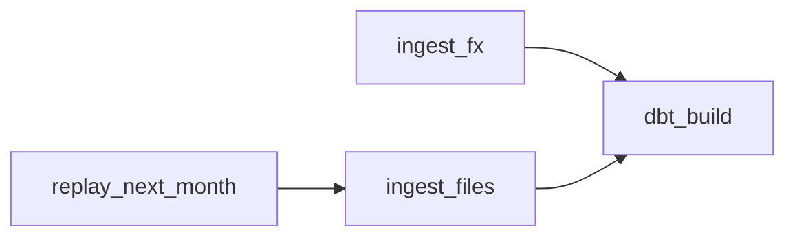
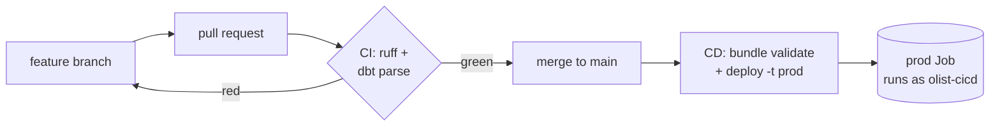

# Olist Lakehouse on Databricks

**English** | [Čeština](README.cs.md)

End-to-end data platform built on **Databricks Free Edition**: simulated daily file drops and a REST API are ingested into a medallion lakehouse, transformed with **dbt**, orchestrated by a **Databricks Job** defined as code (**Asset Bundle**), and shipped through **CI/CD** with GitHub Actions and a service principal.

The goal of the project is not only to produce tables, but to show how a production data pipeline is designed, tested, deployed and operated - and why each decision was made.

---

## Contents

1. [Architecture](#architecture)
2. [Tech stack](#tech-stack)
3. [Data sources](#data-sources)
4. [Repository structure](#repository-structure)
5. [Pipeline](#pipeline)
6. [Data modelling decisions](#data-modelling-decisions)
7. [Marts](#marts)
8. [Data quality](#data-quality)
9. [Environments and deployment](#environments-and-deployment)
10. [CI/CD and governance](#cicd-and-governance)
11. [Known data issues](#known-data-issues)
12. [Free Edition limitations and what I would do at scale](#free-edition-limitations-and-what-i-would-do-at-scale)
13. [How to run](#how-to-run)
14. [Roadmap](#roadmap)

---

## Architecture



| Layer | Where | Tool | Content |
|---|---|---|---|
| landing | `<catalog>.landing` (volumes) | Python | Source files exactly as delivered |
| bronze | `<catalog>.bronze` | Auto Loader, REST | Raw data 1:1, all columns as strings, audit columns |
| silver | `<catalog>.silver` | dbt | Typed, cleaned, deduplicated, renamed to English |
| gold | `<catalog>.gold` | dbt | Conformed dimensions and facts - **all business logic lives here** |
| mart | `<catalog>.mart_<area>_<report>` | dbt | Views for one report: select, filter, aggregate - no new logic |

**Catalog = environment** (`olist_dev`, `olist_prod`), **schema = layer**. The same code builds both environments; only the catalog differs.

---

## Tech stack

| Area | Technology |
|---|---|
| Platform | Databricks Free Edition (serverless compute, Unity Catalog) |
| Ingestion | PySpark, Auto Loader, Python `requests` |
| Transformation | dbt-core 1.12, dbt-databricks 1.12, dbt_utils |
| Orchestration | Databricks Jobs |
| Infrastructure as code | Databricks Asset Bundles |
| CI/CD | GitHub Actions, branch ruleset, service principal (OAuth M2M) |
| Code quality | ruff, dbt parse with warnings as errors, dbt tests |
| Local development | VS Code, Python 3.12 venv, Databricks CLI |

---

## Data sources

- **Olist Brazilian E-Commerce** - ~99k orders from 2016-09 to 2018-10, 9 related tables (orders, items, payments, reviews, customers, sellers, products, geolocation, category translation). Source: Kaggle, licence **CC BY-NC-SA 4.0**.
- **Frankfurter API** - daily exchange rates published by the European Central Bank. Used to convert BRL to EUR, CZK and USD.

Olist is a one-off historical export. To simulate a live source system, the transactional tables are **replayed month by month** (see [Pipeline](#pipeline)).

---

## Repository structure

```
olist-lakehouse-databricks/
├── databricks.yml              # Asset Bundle: variables, dev/prod targets
├── resources/
│   └── olist_daily.job.yml     # The Job: tasks, dependencies, schedule
├── .github/workflows/
│   ├── ci.yml                  # Checks on every pull request
│   └── cd.yml                  # Deploy to prod after merge to main
├── requirements.txt            # Runtime dependencies (dbt)
├── requirements-dev.txt        # Dev/CI tools (ruff)
├── setup/                      # One-time environment setup (run per catalog)
│   ├── 00_unity_catalog        # Catalog, layer schemas, volumes
│   ├── 01_download_olist       # Download dataset into landing
│   ├── 02_prepare_replay_source# Move full extracts to source, reset replay
│   └── 03_replay_months        # Simulated source system (range / next)
├── src/ingestion/              # Reusable, testable Python code
│   ├── config.yml              # Tables, CSV options, FX settings
│   ├── autoloader.py           # Generic CSV -> Delta ingestion
│   ├── api_client.py           # REST client: retries, backoff, timeout
│   └── frankfurter.py          # Incremental FX ingestion with MERGE
├── notebooks/                  # Thin runners used by the Job
│   ├── 01_ingest_files
│   └── 02_ingest_fx
├── dbt/
│   ├── models/staging/         # silver: 1:1 with sources, typed and cleaned
│   ├── models/intermediate/    # silver: reusable technical steps
│   ├── models/gold/            # gold: dimensions and facts, all logic
│   ├── models/marts/           # marts: one schema per report
│   ├── macros/                 # Shared logic (revenue rule, distance, schema names)
│   └── seeds/                  # Small reference mappings (category groups)
├── tests/                      # Python tests (planned)
└── docs/                       # Diagrams and documentation
```

**Why notebooks are thin:** logic lives in `src/` as plain Python modules (testable, linted in CI); notebooks only read parameters and call functions.

---

## Pipeline

The Job `olist_daily` runs every day at 06:00 (Europe/Prague):



| Task | What it does | Why |
|---|---|---|
| `replay_next_month` | Writes the next month of orders, items, payments and reviews into landing | Simulates a source system that delivers new files every day |
| `ingest_files` | Auto Loader loads new files into bronze | Incremental and idempotent: a checkpoint remembers processed files |
| `ingest_fx` | Calls the Frankfurter API from the last loaded date (watermark) and MERGEs into bronze | Runs **in parallel** - it does not depend on Olist files |
| `dbt_build` | `dbt deps` + `dbt build`: seeds, models and tests from silver to marts | Waits for **both** ingestions, so gold is always built from fresh data |

### Replay (simulated source)
- `mode=range` - manual backfill of an explicit month range.
- `mode=next` - used by the Job: finds the last replayed month **from file names** in landing (files are the single source of truth, no extra state table) and writes the next month **that exists in the source** (the source has gaps, so "last + 1" could stall).
- The `orders` file is written **last** and acts as a **commit marker**: a half-written month is redone, never skipped.
- When the source is exhausted the notebook exits cleanly with `no new month`, so the Job stays green.

### Bronze ingestion
- Auto Loader with `availableNow`, all columns as strings (typing happens in silver), schema evolution with rescued data.
- Audit columns: `_ingested_at`, `_source_file`, `_source_file_name`, `_source_file_modified_at`, `_batch_id`.
- FX API client: timeout, retries with exponential backoff on 429/5xx, fail fast on 4xx; long format (one row = date x currency pair) so a new currency is a config change, not a schema change; `MERGE` on `(rate_date, base, quote)` makes re-runs safe.

### dbt layers
- **staging** (`stg_<source>__<table>`): types, renames, trimming, deduplication, source typo fixes - keys never changed.
- **intermediate** (`int_`): reusable technical steps, e.g. average coordinates per zip prefix, daily FX rates with weekend forward-fill.
- **gold**: `calendar`, `customer`, `seller`, `product`, `fx_rate_daily`, `sales_order`, `order_item`, `order_payment`, `order_review`.
- **mart** `mart_sales_overview`: `dim_calendar`, `dim_customer`, `dim_seller`, `dim_product`, `fct_sales_order`, `fct_order_item`, `fct_payment`, `fct_fx_rate`.

---

## Data modelling decisions

| Decision | Why |
|---|---|
| **Gold holds all business logic; marts only select, filter and aggregate** | One definition of every metric. Two reports can never compute "revenue" differently. |
| **Grain first; a metric belongs to its grain** | Delivery time is a property of an order, not of an item. |
| **Never join items to payments directly** | Both relate to orders; joining them multiplies rows and inflates revenue (fan-out). Each is aggregated to order level first. |
| **Customer = person** (`customer_unique_id`) | The source creates a new `customer_id` for every order. Analysing repeat buying needs the real person. |
| **Delivery address belongs to the order** | The source has no CRM; a person can ship to different places (250 customers did). Gold `customer` keeps only `last_delivery_*`. |
| **FX rate of the order date, weekends forward-filled** | Uses only rates known at that time - no look-ahead bias. |
| **Money as `decimal` with a currency suffix** (`_brl`, `_eur`, `_czk`) | Exact arithmetic and the currency is always visible in the column name. |
| **Zip codes as strings, left-padded to 5 digits** | Leading zeros are part of the code, not a number. |
| **`left join` in facts + `not_null` tests** | A fact never silently drops rows; a missing match fails a test instead. |
| **Calendar dimension unfiltered; facts filtered to the analysis period** | Time intelligence in BI needs a complete calendar; incomplete edge months stay out of reports but remain in gold. |
| **Canceled orders kept with a flag** (`is_revenue_eligible`) | Filtering is a reporting choice, not a modelling one. |
| **Reserved words avoided** (`date` -> `calendar`, `order` -> `sales_order`) | No quoting needed in SQL or BI tools. |

---

## Marts

### mart_sales_overview
Answers: *How much do we sell, where, what, and how do customers pay? How do the numbers look in EUR and CZK?*

| Table | Grain (one row = ) | Main content |
|---|---|---|
| `fct_sales_order` | one order | order value and payments in BRL/EUR/CZK, delivery days and delay, flags (delivered, canceled, late, revenue eligible), review score |
| `fct_order_item` | one sold unit | item price and freight in BRL/EUR/CZK, product, seller, seller-to-customer distance |
| `fct_payment` | one payment of an order | payment method, instalments, amount in BRL/EUR/CZK |
| `fct_fx_rate` | one day | BRL to EUR, CZK and USD |
| `dim_calendar` | one day | year, quarter, month, week, weekend, analysis period flag |
| `dim_customer` | one person | last delivery city and state, first and last order, repeat customer flag |
| `dim_seller` | one seller | city, state, coordinates |
| `dim_product` | one product | display name, category, category group |

Facts are filtered to the analysis period (2017-01 to 2018-08); the calendar is complete for time intelligence in BI.

## Data quality

- **dbt tests (133)**: `unique`, `not_null`, `relationships`, `accepted_values`, `dbt_utils` range and expression tests on every layer.
- **Referential integrity is tested from the child side** (`orders.customer_id -> customers`). Customers arrive as a full reference extract while orders arrive monthly, so customers without an order yet are valid.
- **Reconciliation test** (warn): payments per order vs. item value + freight, tolerance 1 BRL.
- **Source freshness** on transactional and FX sources (warn after 2 days, error after 7).
- **Warnings are errors in CI**: a YAML entry that does not match a model fails the pull request - an untested model can never slip through silently.

---

## Environments and deployment

The whole Job is defined in [`databricks.yml`](databricks.yml) and [`resources/olist_daily.job.yml`](resources/olist_daily.job.yml).

| | dev | prod |
|---|---|---|
| Catalog | `olist_dev` | `olist_prod` |
| Job name | `[dev <user>] olist_daily` | `olist_daily` |
| Schedule | paused automatically | daily 06:00 |
| Deployed by | developer, from a laptop | GitHub Actions only |
| Runs as | the developer | service principal `olist-cicd` |

- **Same recipe, different variables**: dev and prod are built from identical code, so what was tested in dev is exactly what runs in prod.
- **Service principal** `olist-cicd`: a technical identity with only the privileges it needs (catalog `olist_prod` and the SQL warehouse, no admin rights). Production keeps working if a person leaves.
- **Fixed prod root path** in the service principal's folder: whoever deploys, there is exactly one production copy.
- No secrets or personal data in the repository: the warehouse is looked up by name, the failure email comes from a variable filled by a GitHub secret.

---

## CI/CD and governance



- **CI** ([`ci.yml`](.github/workflows/ci.yml)) on every pull request: installs pinned dependencies, runs `ruff` on `src/` and `dbt parse --warn-error`. No Databricks access is needed, so it is fast and free.
- **Branch protection** (GitHub ruleset on `main`): changes only through pull requests, merge only with green CI, no deletion and no force push.
- **CD** ([`cd.yml`](.github/workflows/cd.yml)) after every merge to `main`: validates and deploys the bundle to prod, authenticated as the service principal.
- **Secrets** (`DATABRICKS_HOST`, `DATABRICKS_CLIENT_ID`, `DATABRICKS_CLIENT_SECRET`, `ALERT_EMAIL`) live only in GitHub Secrets. The OAuth secret has a limited lifetime and must be rotated.

---

## Known data issues

| Issue | Handling |
|---|---|
| ~250 orders where payments do not match item value + freight (more: card instalment interest; less: vouchers, discounts) | Kept, exposed as `payment_difference_brl`, reconciliation test set to warn |
| Edge months are incomplete (2016, 2018-09, 2018-10) | Analysis period 2017-01 to 2018-08 (dbt vars); facts in marts are filtered, gold keeps everything |
| Typos in English category names (`fashio_female_clothing`, `costruction_tools_*`, `home_confort` ...) and two untranslated categories | Fixed in staging and by a seed; keys never changed |
| One `review_id` can cover several orders | Key of reviews is `review_id + order_id` |
| Geolocation points outside Brazil | Flagged `is_within_brazil`, excluded from per-zip averages |
| Only ~3 % of customers ordered more than once | Business insight, not an error - relevant for retention analysis |

---

## Free Edition limitations and what I would do at scale

| Limitation / shortcut here | At scale |
|---|---|
| Daily compute quota; runs are paused when it is exhausted | Paid workspace with budgets and cluster policies |
| One small shared SQL warehouse; cold start can take many minutes | Dedicated warehouse for the Job with a guaranteed capacity |
| Replay simulates the source, Job runs on a time schedule | Real source + **file arrival trigger**: run when files actually land |
| Full table rebuilds in gold | Incremental models (`merge` on business keys) for large facts |
| No history of attribute changes | SCD2 snapshots for dimensions such as products or sellers |
| CI only parses dbt | CI v2: `dbt build` of changed models into an isolated CI schema |
| Bronze written by notebooks | Lakeflow Declarative Pipelines with expectations for ingestion |

---

## How to run

**Prerequisites:** Databricks workspace (Free Edition is enough), Python 3.12, Databricks CLI, a GitHub repository.

1. **Set up an environment** - run the notebooks in `setup/` with widget `catalog = olist_dev` (or `olist_prod`):
   `00_unity_catalog` -> `01_download_olist` -> `02_prepare_replay_source` -> `03_replay_months` (`mode=range`, e.g. 2016-09 to 2017-12).
2. **Local dbt** - create a venv, `pip install -r requirements-dev.txt`, set `DBT_DATABRICKS_HOST`, `DBT_DATABRICKS_HTTP_PATH`, `DBT_DATABRICKS_TOKEN` (see `.env.example`) and a `~/.dbt/profiles.yml` that reads them, then `cd dbt && dbt deps && dbt build`.
3. **Deploy the Job to dev**
   ```bash
   databricks auth login --host <workspace-url>
   databricks bundle validate
   databricks bundle deploy
   databricks bundle run olist_daily
   ```
4. **Production** is deployed only by CD after a merge to `main`.

---


---

*Data: Olist Brazilian E-Commerce Public Dataset (CC BY-NC-SA 4.0); exchange rates: Frankfurter API / European Central Bank.*
